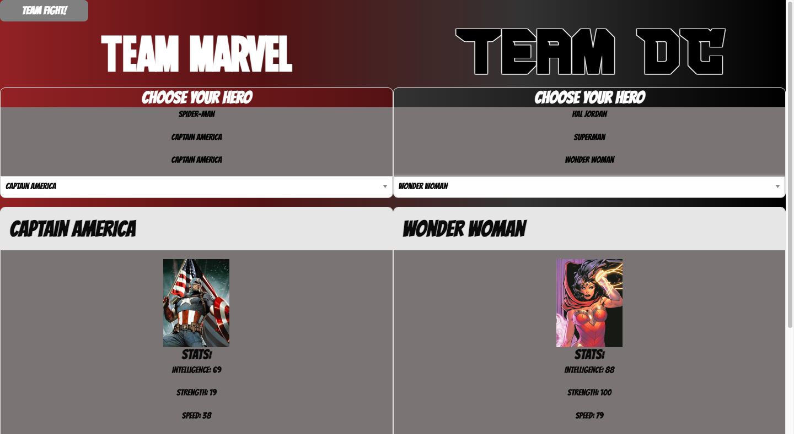
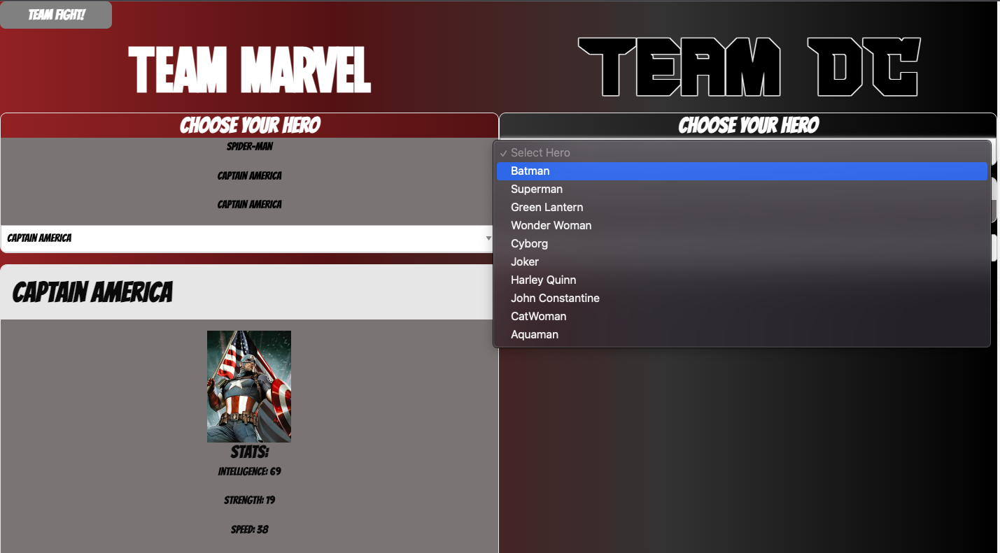
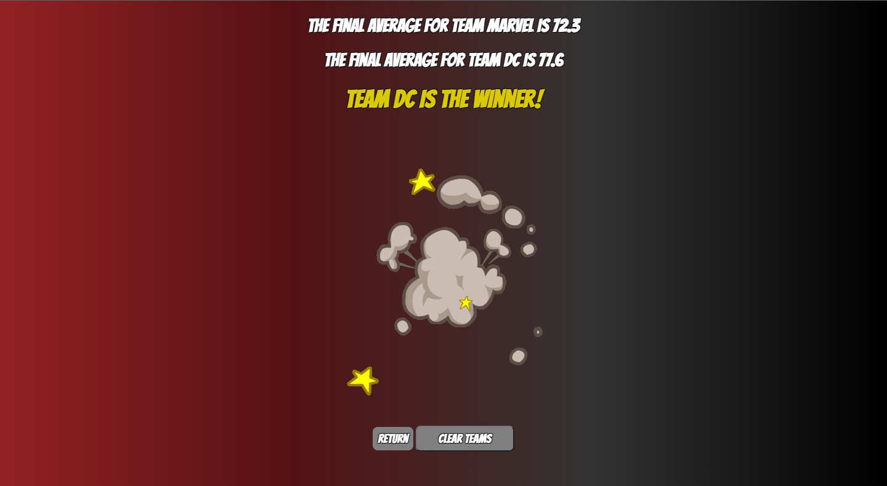

# Project-One: Marvel vs DC

**Brief:**

The application allows the end user to select three Marvel and DC characters. Once three for each franchise has been selected, then the "Team Fight!" button can be clikced. Once the button is clicked the application will average the powerstats for the selected characters as well as the selected movie's IMDb rating to produce an overall average. This avarege conmpares the Marvel selctions to the DC selections to determine a winner. 

The character selections relies on the superhero API to pull the powerstats and the movie selection relies on the IMDb titles API as well as the ratings API to get the RottenTomatoes and MetaCritic ratings. 

The web application can be found [here](https://dasiasmith.github.io/Marvel-Vs-DC/)

Homepage:

User selects a hero option:

Display Winner:

